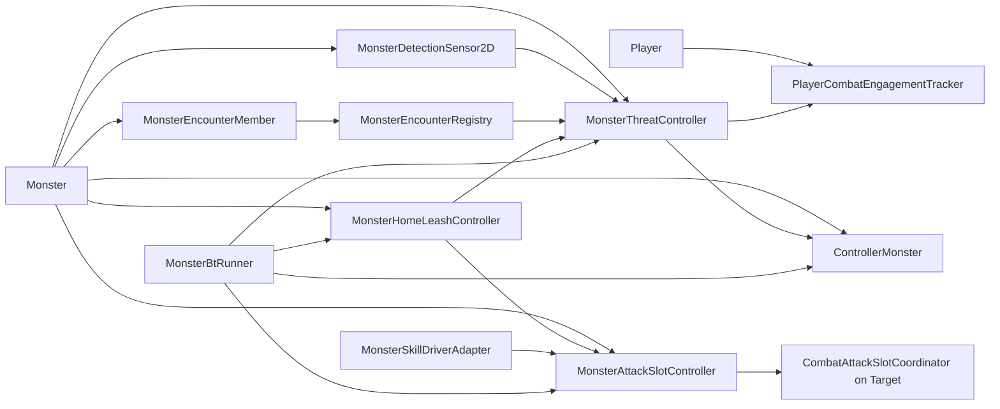
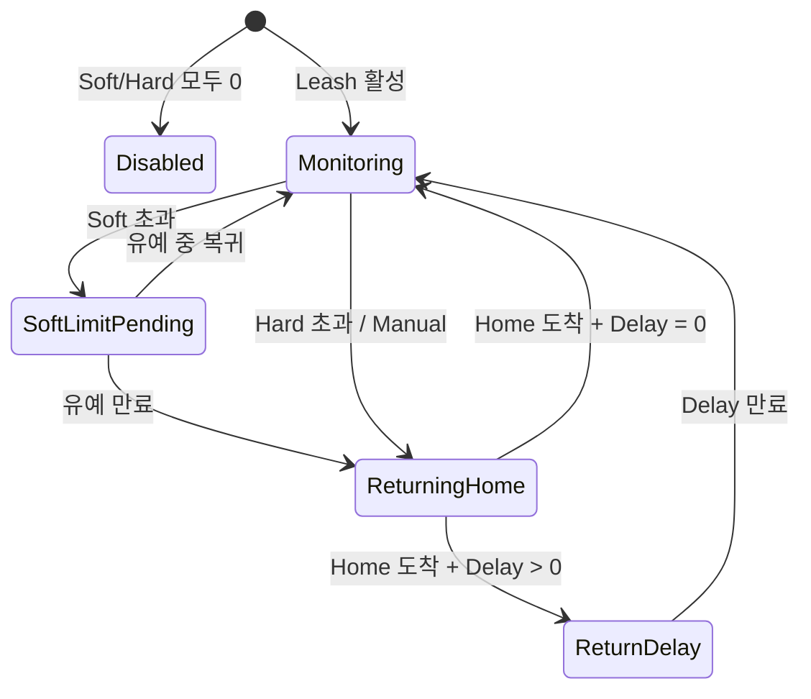
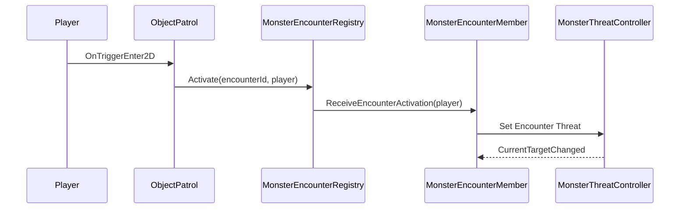
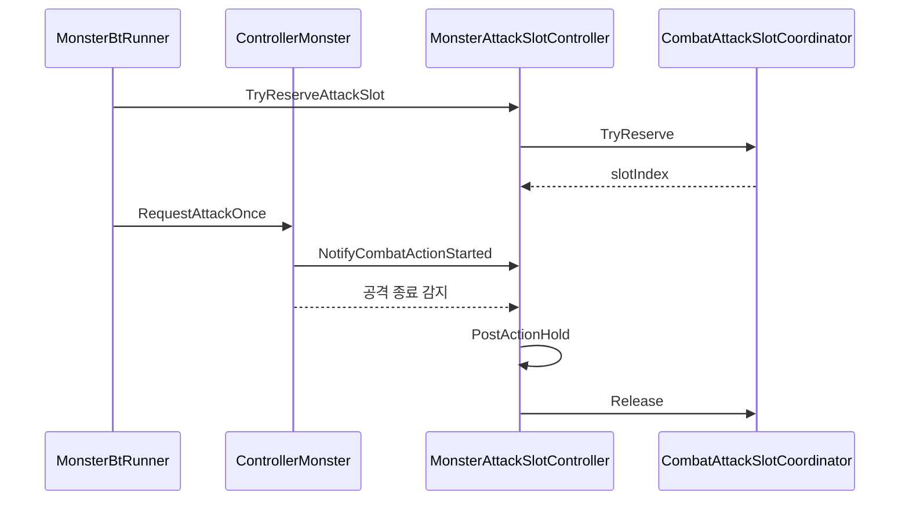
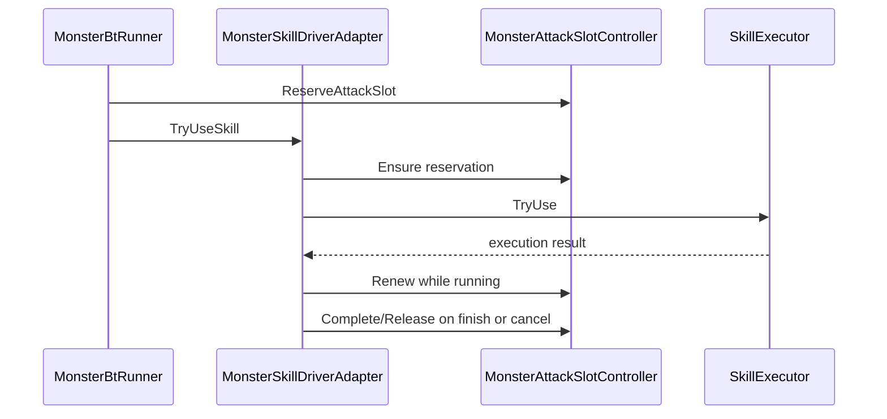

# 개편 전투 시스템 개발 구조 설명서

> 대상: 클라이언트 개발팀, AI/전투 시스템 개발자, 툴 개발자  
> 기준 버전: 전투 시스템 개편 1~6단계  
> 패키지 의존 방향: `Core ← Control ← Skill ← AI_BT`

---

## 1. 설계 개요

개편 전투 시스템은 기존의 단일 `attackerTransform`, 단일 전투 불리언, 공격 Collider 중심 의사결정을 다음 컴포넌트 구조로 분리합니다.

- 플레이어 전투 참여 목록
- 몬스터별 Threat 저장소와 타겟 선택
- 논리 전투 범위 프로필
- Home/Leash 상태 머신
- Encounter 그룹 레지스트리
- 대상별 공격 슬롯 조정자
- Skill 및 BT 어댑터

핵심 원칙은 다음과 같습니다.

1. Core는 전투 상태와 공통 실행 API를 제공합니다.
2. Skill은 스킬 사거리, 실행, 실제 스킬 타격을 담당합니다.
3. AI_BT는 Core/Skill API를 조합하여 의사결정합니다.
4. TimingBattle은 플레이어 전투 상태를 Core 참여 목록에서 조회합니다.
5. 실제 피해 판정 Collider와 AI 의사결정 거리를 분리합니다.

---

## 2. 패키지별 책임

### Core Runtime

- `PlayerCombatEngagementTracker`
- `MonsterDetectionSensor2D`
- `MonsterThreatController`
- `MonsterHomeLeashController`
- `MonsterEncounterMember`
- `MonsterEncounterRegistry`
- `CombatAttackSlotCoordinator`
- `MonsterAttackSlotController`
- `MonsterCombatRangeProfile`
- `MonsterThreatProfile`
- `MonsterLeashProfile`
- `MonsterEncounterProfile`
- `MonsterAttackSlotProfile`
- `TableMonsterCombatProfile`

### Core Editor

- `monster_combat_profile` Addressables 및 TableEditor 노출
- MapEditor의 Patrol/Encounter 배치 데이터 보존

### Skill Runtime

- `MonsterSkillDriverAdapter`
- 스킬 실행 전 공격 슬롯 예약
- 실행 중 슬롯 임대 갱신
- 완료·취소·Leash 시 슬롯 반환
- Leash 시작 시 실행 중 스킬 강제 취소 및 결과 캐시 초기화

### AI_BT Runtime

- Threat, Range, Leash, Attack Slot 선택 인터페이스 조회
- 표준 조건·액션 노드 실행
- BT 디버그 메트릭 기록

### AI_BT Editor

- 신규 노드 카탈로그와 파라미터 UI
- 근접 전투 및 스킬 전투 표준 프리셋
- 레거시 노드 안내 및 데이터 검증

### TimingBattle Runtime

- 플레이어 전투 상태를 `PlayerCombatEngagementTracker` 기준으로 조회
- 맵 전체 몬스터 폴링과 공격 영역 기반 전투 상태 판정 제거

---

## 3. 런타임 구성도



---

## 4. 데이터 로딩 구조

```text
monster.txt
  └─ CombatProfileUid
       └─ monster_combat_profile.txt
            ├─ MonsterCombatRangeProfile
            ├─ MonsterThreatProfile
            ├─ MonsterLeashProfile
            ├─ MonsterEncounterProfile
            └─ MonsterAttackSlotProfile
```

`Monster` 초기화 시 선택한 테이블 행을 각 불변 런타임 프로필로 정규화합니다.

설정값이 없을 때:

- 범위 계열은 기존 공격 Collider 크기를 호환값으로 사용합니다.
- Threat는 안전한 기본값을 사용합니다.
- Leash는 Soft/Hard가 0이면 비활성입니다.
- Encounter 그룹 ID는 Patrol 배치 데이터에서 읽습니다.
- AttackSlotType이 None이면 슬롯 시스템을 건너뜁니다.

---

## 5. Player 전투 참여 목록

### 클래스

```text
Characters/Player/PlayerCombatEngagementTracker.cs
```

### 주요 API

```csharp
bool Register(Monster monster)
bool Unregister(Monster monster)
bool Contains(Monster monster)
void Clear()
bool TryGetNearestEngagedMonster(Vector3 origin, out Monster monster)
int EngagedCount
bool HasEngagements
```

### 책임

- 여러 교전 몬스터를 중복 없이 보관합니다.
- 목록 수로 Player의 `BattleStatus`를 동기화합니다.
- 현재 자동 이동 타겟이 해제되면 남은 대상 중 가까운 몬스터를 선택할 수 있습니다.
- 사망·맵 이동에서 전체 초기화합니다.

### 불변 조건

```text
HasEngagements == (EngagedCount > 0)
EngagedCount > 0 → Player BattleStatus.InBattle
EngagedCount == 0 → Player BattleStatus.None
```

---

## 6. 감지 시스템

### 클래스

```text
Characters/Monster/MonsterDetectionSensor2D.cs
```

### 동작

1. `AttackType.AggroFirst`인지 확인합니다.
2. `MonsterCombatRangeProfile.IsDetectionEnabled`를 확인합니다.
3. 비할당 `OverlapBox`로 Player 후보를 수집합니다.
4. `DetectionRangeX/Y` 안이면 Detection Threat를 등록합니다.
5. 이미 감지한 대상은 `DetectionExitRangeX/Y`와 `ChaseRange`로 유지 여부를 검사합니다.
6. Pool 반환 또는 Leash 귀환 중에는 감지를 중단합니다.

### 주의

- 현재 Line of Sight Raycast는 없습니다.
- Sensor는 후보 감지 책임만 가지며 최종 타겟 선택은 `MonsterThreatController`가 담당합니다.

---

## 7. Threat 및 타겟 선택

### 클래스

```text
Characters/Monster/MonsterThreatController.cs
AI/MonsterThreatProfile.cs
```

### ThreatEntry

대상마다 다음 값을 독립 보관합니다.

```text
DetectionThreat
PatrolThreat
DamageThreat
ExternalThreat
EncounterThreat
LastUpdatedTime
```

총 Threat는 각 원인의 합입니다.

### 주요 이벤트

```csharp
ThreatTargetRegistered
ThreatTargetUnregistered
CurrentTargetChanged
```

### 주요 API

```csharp
SetPresenceThreat(target, source, active, threat)
AddDamageThreat(target, confirmedDamage)
AddThreat(target, source, amount)
ForceTarget(target, durationSeconds)
ClearForcedTarget()
ClearThreat(target)
ClearAllThreats()
TryGetCurrentTarget(out target)
TryGetThreat(target, out threat)
RefreshCurrentTarget()
```

### 타겟 선택 알고리즘

```text
1. 유효한 강제 타겟
2. 총 Threat 최대 대상
3. 동일 Threat이면 최근접 대상
4. 현재 타겟이 유효하면 TargetSwitchThreatRatio 적용
```

### 최대 대상 수

- 기본 16, 최대 64입니다.
- 용량 초과 시 현재 타겟과 강제 타겟을 보호하고 낮은 Threat 항목을 제거합니다.

### 참여 목록 연동

Threat 대상이 Player라면 등록·해제 이벤트를 통해 해당 Player의 `PlayerCombatEngagementTracker`와 동기화합니다.

---

## 8. 범위 시스템

### 클래스

```text
AI/MonsterCombatRangeProfile.cs
Characters/CharacterAttackRange.cs
```

### 책임 분리

```text
MonsterCombatRangeProfile
  ├─ 감지
  ├─ 감지 이탈
  ├─ 기본 공격 시작
  ├─ 선호 전투 거리
  ├─ 추적 한계
  └─ Leash 거리 원본

CharacterBase.colliderAttackRange
  └─ 실제 기본 공격 피해 대상 Overlap

SkillRangeResolver
  └─ 스킬 TargetingMode별 CastRange
```

### 거리 계산

`MonsterCombatRangeMath.TryGetDistances`는 다음 값을 제공합니다.

- 타겟 HitArea 가장자리까지의 수평 거리
- 타겟 HitArea 가장자리까지의 수직 거리
- Transform 중심 사이의 2D 거리

AI는 축별 거리와 중심 거리를 용도에 맞게 선택합니다.

---

## 9. Home 및 Leash 상태 머신

### 클래스

```text
Characters/Monster/MonsterHomeLeashController.cs
AI/MonsterLeashProfile.cs
Characters/Monster/IMonsterLeashLifecycle.cs
```

### 상태



### Home 캡처

`CaptureHome(CharacterRegenData)`가 생성 위치, 초기 방향, 맵 UID를 저장합니다.

### Leash 평가

```text
leashDistance = max(
    owner ↔ home,
    currentTarget ↔ home
)
```

### `BeginEvade` 처리 순서

1. 상태를 `ReturningHome`으로 변경합니다.
2. Threat 전체를 제거합니다.
3. 공격 슬롯을 반환합니다.
4. 외부 이동, Skill, Crowd Control 모션을 취소합니다.
5. 정책에 따라 Affect를 제거합니다.
6. 정책에 따라 자원을 회복합니다.
7. 감지·Threat 등록·일반 Brain을 잠급니다.
8. Home 이동을 시작합니다.

### 생명주기 인터페이스

Skill과 BT 같은 상위 계층은 `IMonsterLeashLifecycle`을 구현하여 다음 콜백을 받습니다.

```csharp
OnLeashEvadeStarted(Monster owner, MonsterLeashTrigger trigger)
OnLeashReturnCompleted(Monster owner)
```

---

## 10. Encounter 시스템

### 클래스

```text
Maps/Objects/Patrol/ObjectPatrol.cs
Maps/Objects/Patrol/PatrolData.cs
Maps/Objects/Patrol/MonsterEncounterRegistry.cs
Characters/Monster/MonsterEncounterMember.cs
AI/MonsterEncounterProfile.cs
```

### 등록

`MonsterEncounterMember.Configure`가 PatrolData의 Encounter ID를 받아 정적 Registry에 등록합니다.

### 활성화 흐름



### 동료 지원

`MonsterEncounterMember.NotifyOwnerEngaged`가 Registry의 `AlertAssistants`를 호출합니다.

- 거리 제한
- 최근접 정렬
- 최대 지원 인원
- 재귀 전파 방지

를 Registry가 담당합니다.

### 해제

`ReleaseEncounterThreatOnExit`이 활성화된 경우 `Deactivate`가 Encounter 원인만 제거합니다.

---

## 11. 공격 슬롯 시스템

### 클래스

```text
Characters/Combat/CombatAttackSlotCoordinator.cs
Characters/Monster/MonsterAttackSlotController.cs
AI/MonsterAttackSlotProfile.cs
```

### Coordinator 위치

Coordinator는 공격 대상의 GameObject에 연결되며 대상별 예약 집합을 관리합니다.

### 예약 키

```text
Owner Monster
SlotType: Melee 또는 Ranged
SlotIndex
RequestedCapacity
LeaseExpireTime
```

### 유효 수용량

현재 같은 SlotType 예약들이 요청한 수용량 중 가장 작은 값을 사용합니다.

```text
effectiveCapacity = min(new request capacity, active reservations requested capacity)
```

### Controller 주요 API

```csharp
CanReserveCurrentTarget()
TryReserveCurrentTarget()
NotifyCombatActionStarted(waitForExplicitCompletion)
NotifyCombatActionCompleted()
ReleaseReservation()
OnCombatTargetChanged(previous, current)
```

### 기본 공격 흐름



### 스킬 흐름



### 안전 장치

- 임대 시간 자동 만료
- 타겟 변경 즉시 반환
- 사망·Pool 반환·Leash 즉시 반환
- 실제 행동이 시작되지 않은 예약은 갱신하지 않아 자동 만료

---

## 12. Core 선택 인터페이스

파일:

```text
AI/IMonsterCombatDriver.cs
```

### 기본 인터페이스

```csharp
IMonsterCombatDriver
```

이동, 정지, 바라보기, 기본 공격, 레거시 어그로 해제 실행을 제공합니다.

### 선택 인터페이스

```csharp
IMonsterMoveStopRangeProvider
IMonsterCombatRangeProvider
IMonsterThreatProvider
IMonsterLeashProvider
IMonsterAttackSlotProvider
```

AI BT는 선택 인터페이스가 없을 때 레거시 동작으로 fallback하여 기존 커스텀 Driver 호환성을 유지합니다.

---

## 13. AI BT 표준 노드

### 신규 조건

| Type ID | 책임 |
|---|---|
| `Condition.HasCombatTarget` | Threat를 갱신하고 유효 타겟 존재 여부를 확인합니다. |
| `Condition.IsTargetInPreferredRange` | 선호 거리 안인지 확인합니다. |
| `Condition.IsTargetTooClose` | 선호 최소 거리보다 가까운지 확인합니다. |
| `Condition.IsTargetTooFar` | 선호 최대 거리보다 먼지 확인합니다. |
| `Condition.IsOutsideSoftLeash` | Owner 또는 Target이 Soft 범위를 초과했는지 확인합니다. |
| `Condition.IsOutsideHardLeash` | Owner 또는 Target이 Hard 범위를 초과했는지 확인합니다. |
| `Condition.IsReturningHome` | 귀환 또는 ReturnDelay 중인지 확인합니다. |
| `Condition.CanReserveAttackSlot` | 현재 대상 슬롯 예약 가능 여부를 확인합니다. |
| `Condition.HasAttackSlotReservation` | 유효한 슬롯 예약 보유 여부를 확인합니다. |

### 신규 액션

| Type ID | 주요 파라미터 | 책임 |
|---|---|---|
| `Action.SelectCombatTarget` | 없음 | Threat 목록에서 현재 타겟을 선택합니다. |
| `Action.MoveToPreferredRange` | `allowRetreat`, `clampToAttackRange`, `stopInRange`, `restartRootInRange`, `giveUpDistance`, `giveUpDistanceKey` | 선호 거리까지 접근 또는 후퇴합니다. |
| `Action.MoveToSkillRange` | `skillUid`, `extraMargin`, `stopInRange`, `restartRootInRange`, `giveUpDistance`, `giveUpDistanceKey` | 지정 스킬 CastRange까지 이동합니다. |
| `Action.BeginEvade` | `trigger` | Core Leash Evade를 시작합니다. |
| `Action.ReleaseCombatTarget` | 없음 | Threat와 전투 타겟 관계를 해제합니다. |
| `Action.ReserveAttackSlot` | 없음 | 현재 대상 슬롯을 원자적으로 예약합니다. |
| `Action.ReleaseAttackSlot` | 없음 | 예약을 즉시 반환합니다. |

### 스킬 노드 추가 파라미터

`Action.UseSkill`, `Action.UseSkillAndWait`:

```text
validateCastRange
castRangeMargin
```

기존 BT 에셋은 파라미터가 없으면 레거시 호환을 위해 CastRange 재검사를 강제하지 않습니다. 신규 Editor 노드는 기본값 `true`입니다.

### 레거시 호환 노드

```text
Condition.HasAggroTarget
Action.MoveToTarget
Action.ClearAggro
```

삭제하지 않았지만 신규 트리에서는 표준 노드를 사용합니다.

---

## 14. 표준 BT 프리셋

### 근접 전투

```text
Root Selector
├─ HardLeashSafety Sequence
│  ├─ HasCombatTarget
│  ├─ IsOutsideHardLeash
│  └─ BeginEvade(HardLimit)
├─ EngageCombat Sequence
│  ├─ SelectCombatTarget
│  ├─ HasCombatTarget
│  └─ AttackOrReposition Selector
│     ├─ Attack Sequence
│     │  ├─ InAttackRange
│     │  └─ Cooldown
│     │     ├─ CanReserveAttackSlot
│     │     ├─ ReserveAttackSlot
│     │     └─ AttackBasic
│     └─ MoveToPreferredRange
└─ Idle
```

### 스킬 전투

```text
Root Selector
├─ HardLeashSafety
├─ EngageSkill Sequence
│  ├─ SelectCombatTarget
│  ├─ HasCombatTarget
│  └─ CastOrApproach Selector
│     ├─ Cast Sequence
│     │  ├─ CanUseSkill
│     │  ├─ IsSkillInCastRange
│     │  ├─ CanReserveAttackSlot
│     │  ├─ ReserveAttackSlot
│     │  ├─ Stop
│     │  ├─ FaceToTarget
│     │  └─ UseSkillAndWait
│     └─ MoveToSkillRange
└─ Idle
```

---

## 15. Pool 및 생명주기

다음 컴포넌트는 `IMonsterPoolLifecycle`을 구현합니다.

- `MonsterDetectionSensor2D`
- `MonsterThreatController`
- `MonsterHomeLeashController`
- `MonsterEncounterMember`
- `MonsterAttackSlotController`
- `MonsterSkillDriverAdapter`

Pool Rent 시:

- Owner 재바인딩
- Home 재캡처
- 프로필 재적용
- Encounter 재등록
- 런타임 캐시 초기화

Pool Return 시:

- Threat 제거
- 참여 목록 해제
- 공격 슬롯 반환
- Encounter 등록 해제
- 감지 후보와 타이머 초기화
- 실행 중 스킬 및 결과 캐시 정리

Destroy, 비활성화, 사망 경로에서도 동일한 관계 정리가 누락되지 않아야 합니다.

---

## 16. 디버그 정보

BT Runtime은 다음 메트릭을 기록합니다.

```text
ThreatTargetCount
CurrentTargetThreat
AttackSlotEnabled
HasAttackSlotReservation
AttackSlotIndex
IsReturningHome
Leash 관련 거리
선호 거리 관계
```

주요 슬롯 디버그 사유:

```text
AttackSlotProviderMissing
AttackSlotUnavailable
AttackSlotReserved
```

Scene Gizmo:

- 감지 진입 범위
- 감지 이탈 범위
- Home 위치
- Soft Leash 범위
- Hard Leash 범위

---

## 17. 확장 지점

### Threat 확장

- 힐 Threat
- 지속적인 Threat 감쇠
- 클래스별 Threat 배율
- 도발 면역 및 우선순위 계층

추가 시 `MonsterThreatSource`, `ThreatEntry`, `MonsterThreatProfile`을 함께 확장해야 합니다.

### 감지 확장

- Line of Sight
- 은신·투명 상태
- 소리 감지
- 진영 및 파티 필터

Sensor는 후보 수집만 담당하고 Threat 등록은 기존 API를 사용합니다.

### 공격 슬롯 확장

현재 슬롯 인덱스를 이용하여 다음을 추가할 수 있습니다.

- 좌우 포메이션 좌표
- 근접 링과 원거리 링
- 보스 주변 전용 슬롯
- 대형 몬스터가 2개 이상의 슬롯을 점유하는 Weight 정책

### Encounter 확장

- Encounter 전용 상태 관리자
- Wave 진행
- 문 잠금·해제
- Encounter 완료 이벤트
- 그룹 공용 Leash 또는 전투 구역

---

## 18. 변경 시 준수 사항

1. Core에서 AI_BT 또는 Skill 구체 타입을 참조하지 않습니다.
2. 신규 상위 기능은 Core 선택 인터페이스 또는 생명주기 포트로 연결합니다.
3. 실제 피해 Collider와 논리 전투 범위를 다시 결합하지 않습니다.
4. 개별 몬스터가 Player의 전투 상태를 직접 None으로 설정하지 않습니다.
5. Threat 원인 하나를 제거할 때 대상의 다른 원인을 지우지 않습니다.
6. 타겟 변경, 사망, Evade, Pool 반환 시 공격 슬롯을 반드시 정리합니다.
7. 기존 BT 타입 ID는 저장된 에셋 호환을 위해 임의로 변경하지 않습니다.
8. 신규 테이블 컬럼은 누락·빈 값에 대한 fallback을 제공합니다.

---

## 19. 테스트 권장 매트릭스

| 영역 | 테스트 |
|---|---|
| 참여 목록 | 1:N 교전, 일부 사망, 일부 귀환, 맵 이동 |
| Threat | 동일 Threat 거리 비교, 전환 비율, 강제 타겟, 현재 타겟 사망 |
| 감지 | AggroFirst/PassiveDefense, 진입·이탈 경계, 풀 재사용 |
| 거리 | 근접·원거리 선호 거리, 수직 차이, 스킬 TargetingMode별 CastRange |
| Leash | Soft 복귀, Soft 만료, Hard 즉시, 이동 실패 Timeout, 자원 회복 정책 |
| Encounter | 볼륨 활성화, 이탈 유지·해제, 지원 거리, 최대 지원 수 |
| 슬롯 | Melee/Ranged 독립, 수용량 충돌, 행동 취소, 임대 만료, 스킬 실패 |
| BT | 신규 프리셋, 레거시 에셋, Provider 누락 fallback, 디버그 메트릭 |
